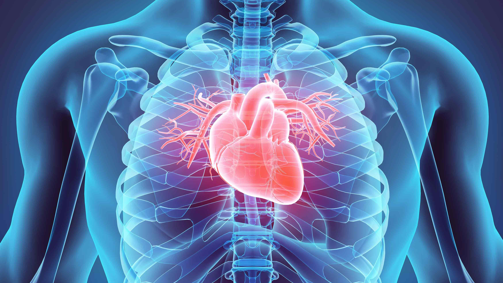
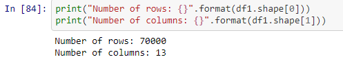
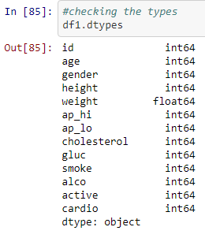
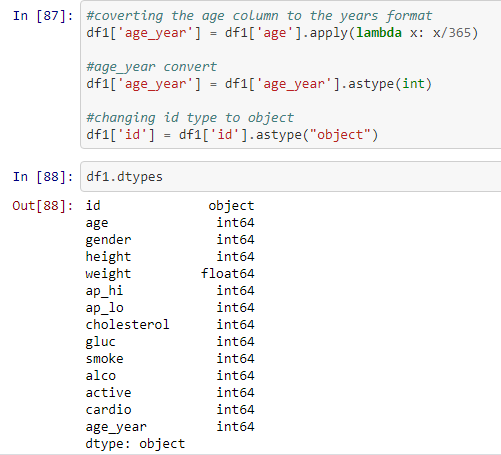
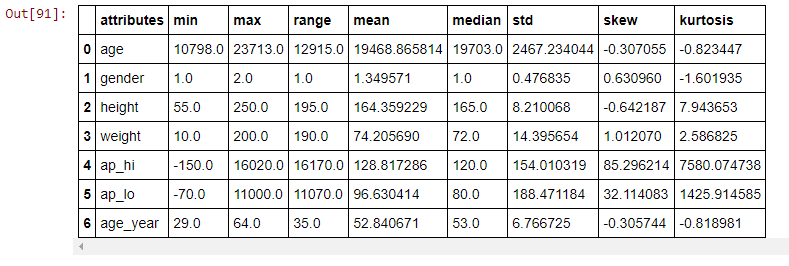
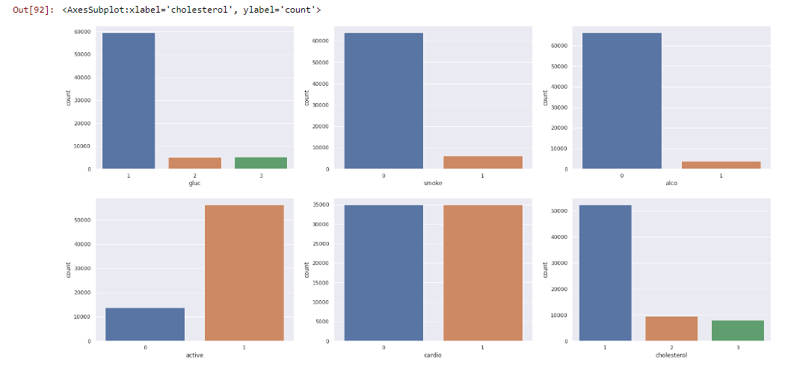
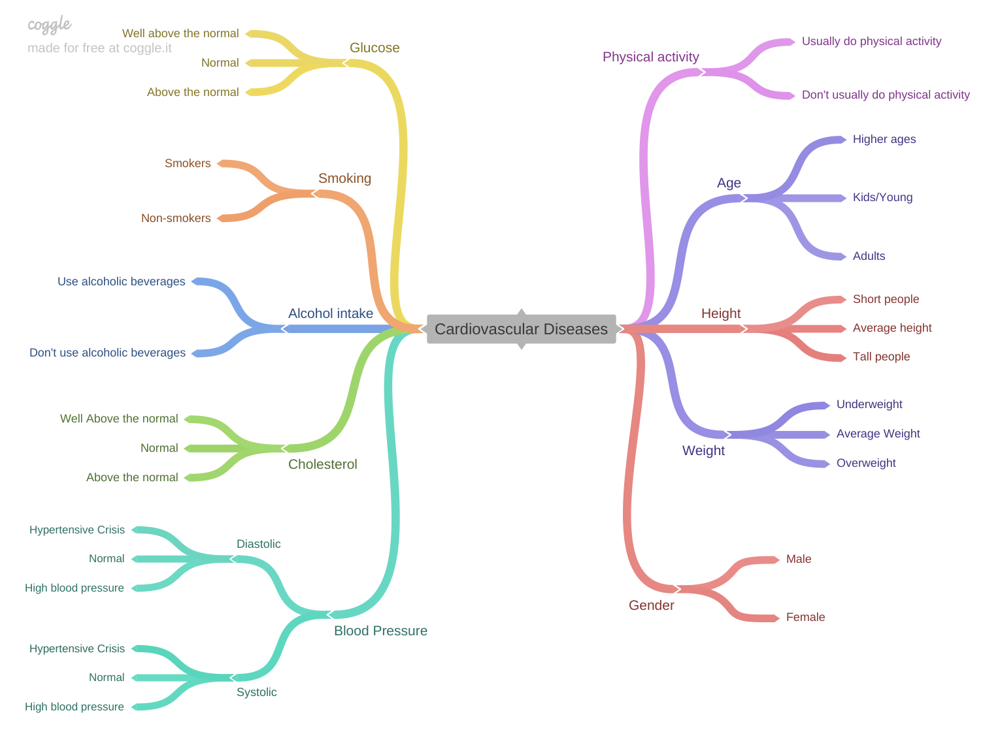
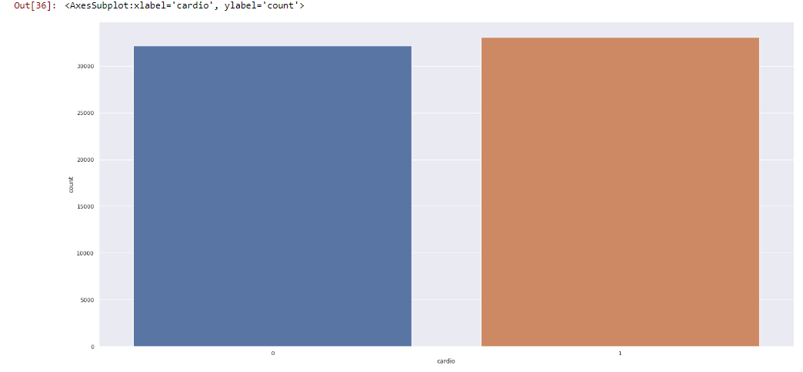

# CARDIO CATCH DISEASES COMPANY - HEALTHCARE AND ARTIFICIAL INTELLIGENCE

# 1.0. CONTEXT

Cadio Catch Diseases is a company that specializes in detecting heart disease in the early stages.The company offers an early diagnosis of cardiovascular disease for a certain price. Currently, the diagosis is made manually. The currently accuracy used to be between 55% and 60%, because of the complex diagnostics and the team's tiredness, there's a another employees on other shifts.

# 2.0. BUSINESS PROBLEM

There are some points that is important to know:

- Each diagnosis costs about $1000,00

- The price will vary according to the precision, the customer pays $500.00 for every 5% accuracy above 50%.

- If the diagnostic precision is 50% or below, the customer doesn't pay for it.

What is the objective?
- Build a predictive model to classify cardiovascular diseases.

Why is this necessary?
- Because the price will vary according the precision.

What do we need to show?
- The accuracy and precision of the model.
- How much profit will Cardio Catch Diseases have after the project?
- How reliable is our result?

Business problem reference: https://sejaumdatascientist.com/projeto-de-data-science-diagnostico-precoce-de-doencas-cardiovasculares/

# 3.0. DATA DESCRIPTION 

## 3.1. Data Dimensions

## 3.2. Data Types

As we can see bellow, we have 2 data types: int64 and float64. It's important to explain that machine learning algorithms usually build a better learning with numerical data, this is one of the premises that we will assume.

## 3.3. Change Types

The "id" column is a "int64" but, we won't execute any mathmatical operation because it is just a indentifying column. Therefore, we could change it to a categorical data or maybe to drop it, but let's to change the type to "object". Another point that we need to note is that our "age" column has an "days" format, so let's switch to the "age" format.

## 3.4. Statistical Descriptive

### 3.4.1. Numerical Attributes

From this table, we can get some informations:

- There aren't children included in the dataset
- The minimum value for the "height" column is 55, but the minimum value for the age_year column is 29. As we said, we don't have children included in the data set
- "ap_hi" and "ap_lo have a high skew, this probably means that we have a non-symmetric graph shifted to the right.
- If we remember that a person who has systolic blood pressure of 180mmHg must urgently go to the doctor and with a diastolic pressure greater than 120mmHg. However, we have as maximum values in the columns "ap_hi" and "ap_lo" the values 16020.0 and 11000.0 respectively. This is a strange value that needs to be analyzed soon, but it could indicates that it is an outlier.
- There are also negative values for the columns "ap_hi" and "ap_lo", this represents an inconsistent value.

### 3.4.1. Binary and Ordinal Attributes

From these plots we can get some informations:

- There is much more data from people with normal glucose levels.

- Our target variable has balanced data, which is very good, it will avoid a lot of work.

- The number of people who do physical activities is considerably greater than those who don't.

# 4.0. MINDMAP HYPOTHESIS

From the mind map above, we created some features to validate the hypotheses.

# 5.0. EXPLORATORY DATA ANALYSIS 

## 5.1. Univariate Analysis

- As we can see, we have our classes balanced.

