# CARDIO CATCH DISEASES COMPANY - HEALTHCARE AND ARTIFICIAL INTELLIGENCE

# 1.0. CONTEXT

Cadio Catch Diseases is a company that specializes in detecting heart disease in the early stages.The company offers an early diagnosis of cardiovascular disease for a certain price. Currently, the diagosis is made manually. The currently accuracy used to be between 55% and 60%, because of the complex diagnostics and the team's tiredness, there's a another employees on other shifts.

# 2.0. BUSINESS PROBLEM

There are some points that is important to know:

- Each diagnosis costs about $1000,00

- The price will vary according to the precision, the customer pays $500.00 for every 5% accuracy above 50%.

- If the diagnostic precision is 50% or below, the customer doesn't pay for it.

What is the objective?
- Build a predictive model to classify cardiovascular diseases.

Why is this necessary?
- Because the price will vary according the precision.

What do we need to show?
- The accuracy and precision of the model.
- How much profit will Cardio Catch Diseases have after the project?
- How reliable is our result?

Business problem reference: https://sejaumdatascientist.com/projeto-de-data-science-diagnostico-precoce-de-doencas-cardiovasculares/

# 3.0. DATA DESCRIPTION 

## 3.1. Data Dimensions

## 3.2. Data Types

As we can see bellow, we have 2 data types: int64 and float64. It's important to explain that machine learning algorithms usually build a better learning with numerical data, this is one of the premises that we will assume.

## 3.3. Change Types

The "id" column is a "int64" but, we won't execute any mathmatical operation because it is just a indentifying column. Therefore, we could change it to a categorical data or maybe to drop it, but let's to change the type to "object". Another point that we need to note is that our "age" column has an "days" format, so let's switch to the "age" format.

## 3.4. Statistical Descriptive

### 3.4.1. Numerical Attributes

From this table, we can get some informations:

- There aren't children included in the dataset
- The minimum value for the "height" column is 55, but the minimum value for the age_year column is 29. As we said, we don't have children included in the data set
- "ap_hi" and "ap_lo have a high skew, this probably means that we have a non-symmetric graph shifted to the right.
- If we remember that a person who has systolic blood pressure of 180mmHg must urgently go to the doctor and with a diastolic pressure greater than 120mmHg. However, we have as maximum values in the columns "ap_hi" and "ap_lo" the values 16020.0 and 11000.0 respectively. This is a strange value that needs to be analyzed soon, but it could indicates that it is an outlier.
- There are also negative values for the columns "ap_hi" and "ap_lo", this represents an inconsistent value.

### 3.4.1. Binary and Ordinal Attributes

From these plots we can get some informations:

- There is much more data from people with normal glucose levels.

- Our target variable has balanced data, which is very good, it will avoid a lot of work.

- The number of people who do physical activities is considerably greater than those who don't.

# 4.0. MINDMAP HYPOTHESIS

From the mind map above, we created some features to validate the hypotheses.

# 5.0. EXPLORATORY DATA ANALYSIS 

## 5.1. Univariate Analysis

### 5.1.1. Response Variable

- As we can see, we have our classes balanced.

### 5.1.2. Numerical Varibles

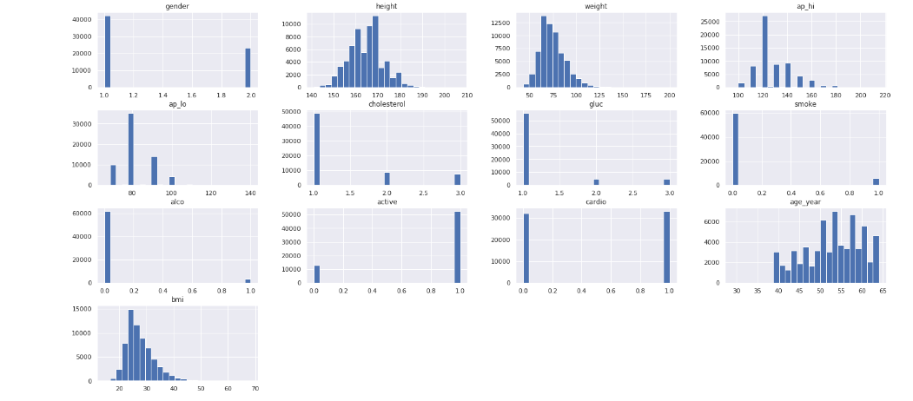

From the graphs above, we can get some conclusions:

- gender
  - Our class that has the gender "1" has almost twice the gender class "2".
- height
  - It has a distribution similar to a normal one.
- weight
  - It has a distribution similar to a normal one.
- bmi
  - It has a distribution similar to a normal one.
  
### 5.1.3. Categorical Attributes

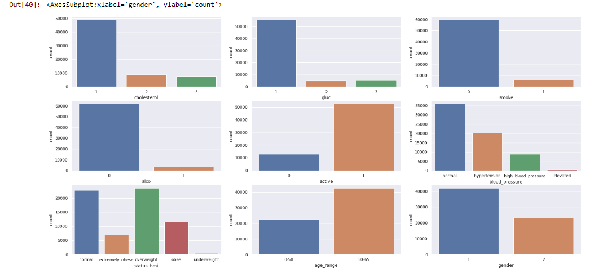

From these plots, we've got some informations:

- The number of people with normal weight and overweight are very close. The number of obese people is half the number of people with normal weight.
- There are twice as many people between 50-65 than 0-50.
- There are almost twice as many people of gender 1 compared to 2.
- The number of hypertensive people is half that of normal people.

## 5.2. Bivariate Analysis 

### 5.2.1. Hypothesis

**H1. There are more cases of cardiovascular diseases in older people.**
True -  It is true until the age of 59, after that, there is a drop in the number of people with cardiovascular diseases.

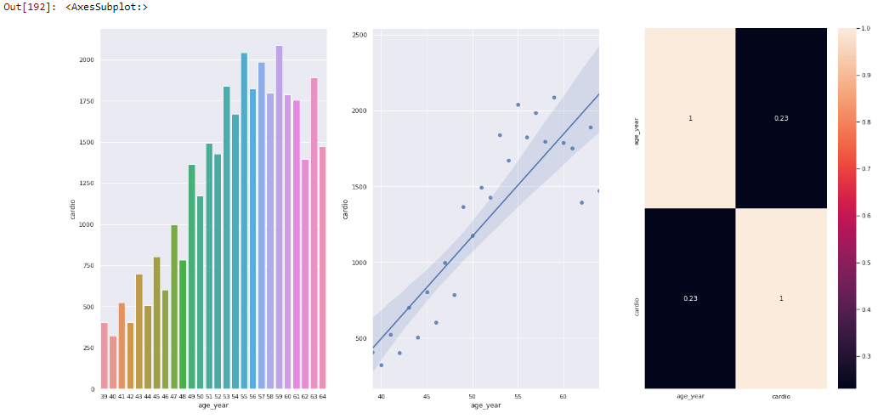

From these plots, we can get some informations:

- There is a growing trend between age and the number of people with cardiovascular disease.
- After 59 years, we can see a drop in the number of people with cardiovascular disease.
- The "age" variable has a low correlation with our target variable.

**H3. There are more cases of cardiovascular disease in people with high diastolic and systolic pressure.**
True Although the number of people with hypertension is higher, there are more cases of people with normal blood pressure than with high blood pressure.

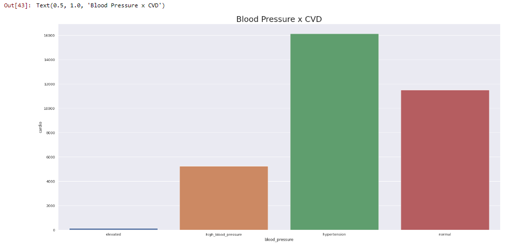

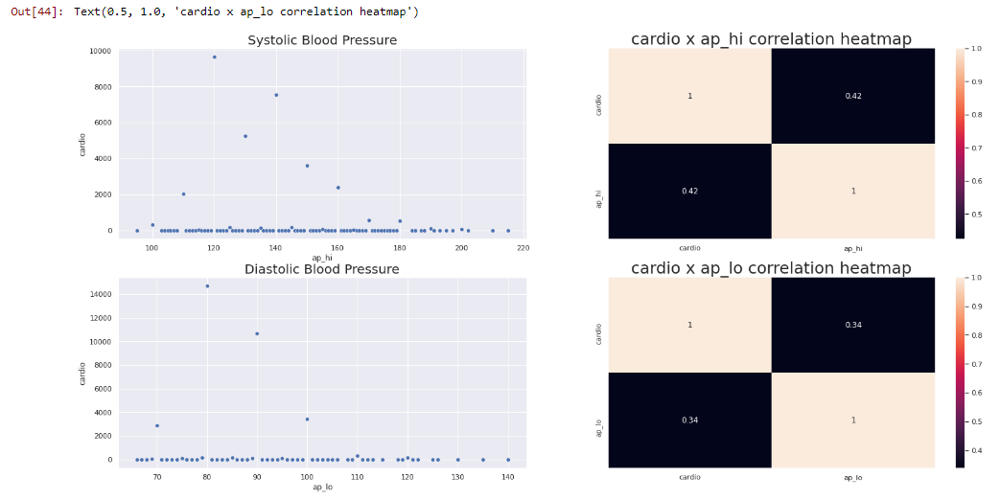

What can we get about the plots above?

- There are many people with hypertension and cardiovascular disease. However, there are also a lot of people without hypertension and with cardiovascular disease.
- In scatterplots, we can see some points with a very high number of cases of cardiovascular diseases. For example, there are almost 10,000 people with 120mmHg of systolic blood pressure with CVD.
- In both types of blood pressure, we have a positive correlation with our target variable. Systolic blood pressure has a moderate correlation and diastolic blood, a weak correlation.

**H6. There are more cases of cardiovascular disease in people who are overweight.**
True However, the number of cases in obese people is less than the number of cases of people with normal weight. The number of extremely obese people with cardiovascular disease is almost half the number of people with a normal person.

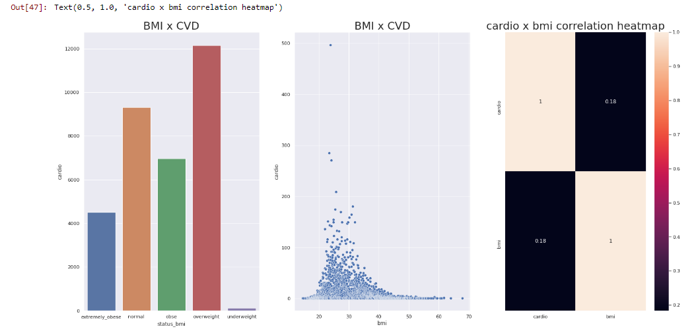

- The number of cases in obese people is less than the number of cases of people with normal weight.
- The number of extremely obese people with cardiovascular disease is almost half the number of people with a normal person.
- There's a low positive correlation between bmi and cardio.

## 5.3. Multivariate Analysis

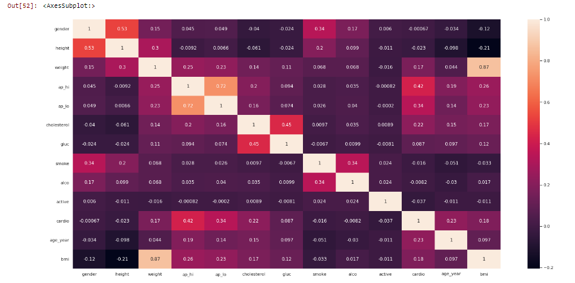

# 6.0. DATA PREPARATION

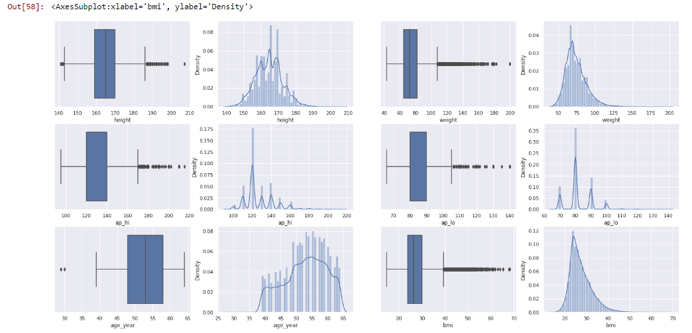

- RobustScaler
  - ap_lo
  - ap_hi
  - bmi
  - Weight
  
- MinMaxScaler
  - age_year
  - height
  
 # 7.0. MACHINE LEARNING MODELLING
 
 ## 7.1. Single Performance
 
 
 
 We obtained the following results, however, in order for our model to be reliable, we applied the cross-validation technique.
 
 ## 7.2. Real Performance - Cross-Validation
 
 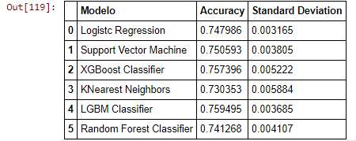
 
 ## 7.3. ROC Curve
 
 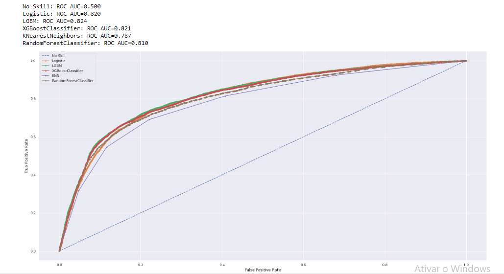
 
 ## 7.4. Hyperparameter Fine Tunning
 
 In machine learning, hyperparameter optimization or tuning is the problem of choosing a set of optimal hyperparameters for a learning algorithm. A hyperparameter is a parameter whose value is used to control the learning process. By contrast, the values of other parameters (typically node weights) are learned.

Therefore, we will use the RandomSearchCV algorithm beacuse, the method described herein is a type of local random search, where every iteration is dependent on the prior iteration's candidate solution. So, we will spend less time to obtain the result.

In our best algorithm, we apply the technique to find the best parameters. Below, we can see its performance with the chosen parameters.

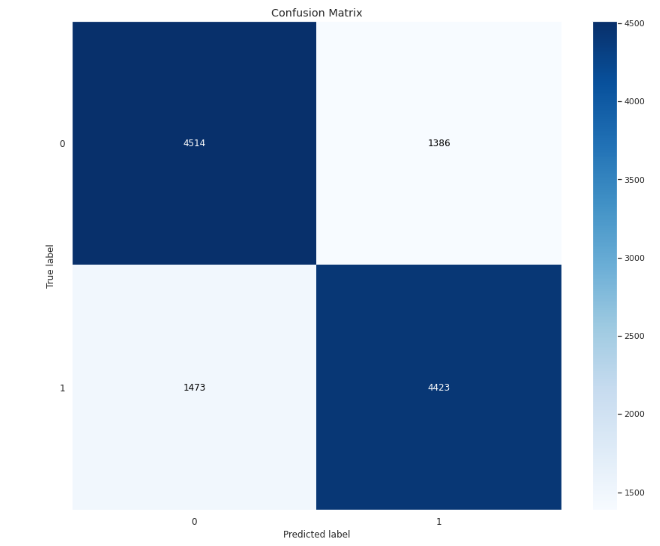

# 8.0. BUSINESS PERFORMANCE

